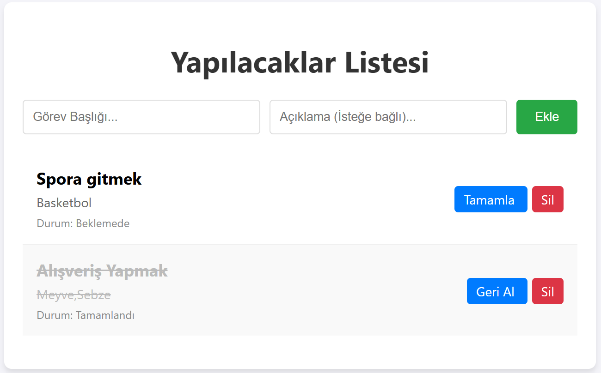

# OOP Tabanlı To-Do Uygulaması

Bu proje, Python, Flask ve SQLAlchemy kullanılarak geliştirilmiş; Nesne Yönelimli Programlama (OOP) prensiplerine dayalı bir yapılacaklar listesi uygulamasıdır.

## Özellikler
- **OOP Yapısı:** Görevler birer Python sınıfı (Class) olarak modellenmiştir.
- **CRUD İşlemleri:** Görev ekleme, okuma, güncelleme (Tamamlandı/Beklemede) ve silme.
- **ORM:** SQL komutları yazmadan veritabanı yönetimi.

## Ekran Görüntüsü


## Kurulum

1. Projeyi klonlayın:
   ```bash
   git clone https://github.com/ozanil96/tech_istanbul_bootcamp_projesi
   cd tech_istanbul_bootcamp_projesi

2. Gereksinimleri yükleyin:
   ```bash
   pip install -r requirements.txt

3. Uygulamayı çalıştırın:
   ```bash
   python app.py

4. Tarayıcıda http://127.0.0.1:5000 adresine gidin.